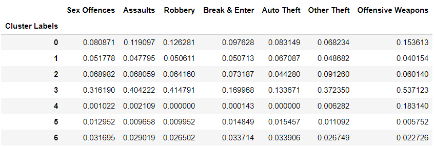
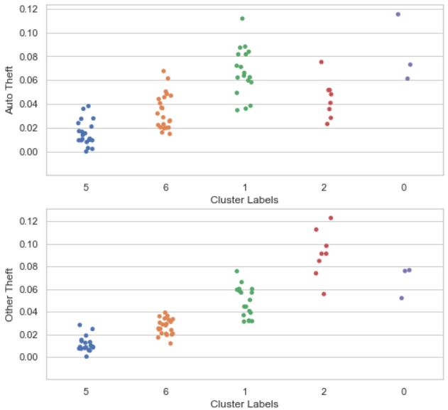

# Clustering Neighborhoods by crime data
## Introduction
In 1950, the percentage of the world population living in urban areas was just 30%, as opposed to rural areas. As urbanization runs its course in this fast-growing era, this number is projected to increase to 68% in 2050 as estimated by the UN. Amongst this, Canada is estimated to have a higher-than-average urban population of 87% by 2050. That means that compared to 2021, 8 million more people will try to squish into its cities![1]

As someone living in Vancouver, one of the most populous cities in Canada, I believe urban municipalities need to be prepared to welcome these newcomers. Although Canada is a relatively safe country, it is not without crime. Newcomers should understand the crime scene and choose carefully about where to live.

My goal for this project is to help migrants understand the safety of the urban neighborhoods in Canada by categorizing them. I will be clustering neighborhoods in the top three Canadian cities with respect to their crime data.

## About the data
#### Source
I have chosen the cities Toronto, Montreal, and Vancouver to conduct my analysis in. Luckily, the police department in each city makes their data openly accessible on their websites.

The respective forces are: Vancouver Police Department (VPD) [2] in Vancouver, Toronto Police Service (TPS) [3] in Toronto, and Service de police de la ville de Montreal (SPVM) [4] in Montreal.

I need to get the data for crime distribution across neighborhoods. This specific information is shared in the annual reports. Below is an example of the data format upon retrieval:

I retrieved the data for the year 2019 because I expect crime in 2020 will differ from the norm due to COVID-19 and social distancing.

#### Preparation
There are slight differences in how the data is presented between each police force. For example for VPD and not the others, homicide and attempted murders were excluded in the crime by neighborhood dataset, presumably to not cause distress in the public by knowing where homicide occurred. I am only including features that are shared by all three datasets. These are: Sex Offences, Assaults, Robbery, Break & Enter, Auto Theft, Other Theft, and Offensive Weapons.

In addition, I want to use crime occurrence _rate_ rather than the occurrence _number_. I converted the values as follows: 
$$
\text{crime rate} = \frac{\text{Number of occurrences for a crime type in a neighborhood}}{\text{All occurrences for that crime type in the municipality}}
$$
Note that the crime rate is calculated relative to crimes in the city the neighborhood is in rather than in all three cities. For example, a neighborhood in Vancouver with a value of 0.1 for "Sex Offences" means 10% of sex offences in Vancouver occurred there.

The head of the final dataset looks as such: 

There are 73 rows (neighborhoods) in total, and 7 features (crime types).

## Exploratory analysis
#### Heat map
The heatmap below shows the correlation between different crime types, with the color bar depicting color correspondence to the correlation coefficient. We observe that the rate of different crimes generally correlate with each other (most blocks are white to orange colored).  This makes sense when you think about the fact that unsafe neighborhoods tend to have high occurrences of all crime types.

The exception would be the "Auto Theft" crime type (mostly purple blocks). It seems to have relatively weaker correlation with other crimes (r <0.7).

#### Box plot
The boxplot shows the distribution of values for different crime types. We can see that for all crime type, most neighborhoods contribute less than 10% to a city's total. However there are outlier neighborhoods who contribute up to 50%.

## Modeling
#### Model
I chose to use agglomerative clustering which is an unsupervised hierarchical clustering technique.

In this machine learning technique, every data point starts off as an individual cluster. The distance between each cluster is computed. Based on this, the clusters closest together are combined into a new cluster. The distance is computed again between the new set of clusters. And the process repeats until all data points are in one big cluster.

I chose this model because it is simple and the clustering process can be visualized via a dendrogram for better understanding.

#### Interpreting dendrogram
The dendrogram is useful because it visualizes where and which data points joined together to help with understanding the relationship between clusters.

Features of the graph:
- The y-axis indicates distance computed between points/clusters
- Each point stemming from the x-axis is either a data point or a node. If the label is enclosed in square brackets then it is a node, otherwise it is the name of a neighborhood
- A node is a cluster consisting of more than one data points. For the node label, the first number in square bracket is the node number and the second is the number of data points in that node
- Each horizontal line indicates the joining of two data points/nodes

We can see that as the distance increases, clusters are joined together into bigger clusters until the very top where all points are under one big cluster.

For my model, I set distance threshold to 0.2 and resulted in 7 clusters. One way to visualize this is to follow the gridline at distance=0.2 and observe that there are 7 vertical lines in the graph intersecting with it.

## Cluster analysis
#### Outlier analysis
By outlier, I mean the neighborhoods that are not clustered to any other neighborhood i.e. the "lone" neighborhoods that consist a cluster by itself.

The table below shows the number of neighborhoods in each cluster. We can see that cluster 3 and 4 are outliers.

After identifying the outliers let's find out what makes them special. The table below shows the means for the different crime types in each cluster.

First off, I noticed for a given cluster the crime rate is similar across each category. For example, average crime rates for cluster 0 reside in a close range of 8% to 15% while for cluster 1 it ranges 4% to 7%. This agrees with our observation from the heat map that the crime rates generally correlate with each other. This could also be why the clusters are divided the way they are. We will get to that later.

For cluster 3, we can see that the crime rate is significantly higher than other clusters across all categories. For example, cluster 3 takes up 32% of sex offences in the city whereas other clusters take up between 0.1% to 8%.

To give some context, cluster 3 is Vancouver's central business district which includes the area known as "downtown eastside". While Vancouver is fairly safe elsewhere, downtown eastside is infamous for its high crime rate, drug issues and homelessness (trust me, I live in Vancouver). I think it makes sense that it contributes an absurdly high percentage of crimes to the city and thus is an outlier.

For cluster 4, we see a special situation where the crime rate is high for offensive weapons at 18% but very low across all other categories (0.0% to 0.06%). This deviates from the correlation pattern in the rest of the data where crime rate is similar across all categories.

Cluster 4 is Montreal's airport district. The data makes sense to me because firearms are often caught at airport checkpoints. Furthermore, there is likely not many people living in the area, which means less people to commit crimes, hence the low value in all other crime types.

#### Understanding other clusters

Next, I want to understand the pattern that formed the clusters, why the neighborhoods are grouped the way they are.

I already have an idea from observing the means table that each cluster is unique in the level of crime there is across all categories. For example cluster 5 seems to have lower crime than cluster 6, which in turn has lower crime than cluster 1 and so on. To visualize this, I plotted a comparative bar chart below based on the average crime rate in each category.

We observe that in general, cluster 5 has lowest crime, then 6, then 1, then 2, and cluster 0 has highest crime. The exception to this pattern would be 'Auto Theft' and 'Other Theft' which deviates only a little. This further strengthens my theory that the neighborhoods are grouped based on the severity of crime in general.  This is juxtaposed to the idea that one cluster could be high only in sex offence whereas another could be high only in robbery. It confirms the notion that different crimes occur together rather than separate (for the most part).

Note that outliers are ignored for this part of the analysis.

Plotting the average doesn't tell us the distribution of values. It is possible that values are highly variable or skewed inside each cluster, in which case comparing averages would be misleading. A strip plot shows the distribution of values in each cluster. Below is a strip plot for each crime type.

We observe that there are overlaps in the values between clusters. However it is also clear that the order stays the same with cluster 5 having the lowest crime and cluster 0 the highest.

   

Based on my analysis, this is how I am naming the clusters:

|Cluster        |Name               |
|---------------|-------------------|
|5              |very low crime     |
|6              |low crime          |
|1              |medium crime       |
|2              |high crime         |
|0              |very high crime    |

## Visualize clusters on map

To visualize the clustering results, I plotted dots for each neighborhood on a map of the city with different colors representing different clusters.

Below are snapshots of the map. View the interactive map [here](https://nbviewer.jupyter.org/github/jasmineshi/Neighborhoods_crime/blob/main/4-visualizing_clusters_on_map.ipynb) (where you can click on the dots to see neighborhood name and cluster label).

Some observations from the map results:

- In Vancouver, there are some very low crime neighborhoods and some extremely high crime neighborhoods i.e. the crime is concentrated in a few areas
- Toronto, in contrast has mostly medium crime to high crime areas. There are no extremes and crime is distributed evenly across the city
- Montreal is in the middle with very high crime and very low crime neighborhoods, but no extremes

Vancouver

Toronto

Montreal

## Final thoughts
I used agglomerative clustering technique to group the neighborhoods based on crime rate.
 I was able to understand the clustering results through analysis and name each group in an explanatory way. Lastly, I visualized the results on a map.

A shortcoming of this project is that Toronto police data was presented differently from that of Vancouver's and Montreal's, which might have affected the results. For VPD and SPVM, the data were divided by neighborhoods. But for TPS, it was actually divided by districts, in which each one includes 3 or 4 neighborhoods. Districts are much bigger than neighborhoods, thus it was not completely accurate to compare it with the neighborhoods in the other cities. Bigger area means that the extreme crime scenes in some neighborhoods may have been balanced out by the more typical crime scenes of their neighbors. This can explain why the Toronto clustering results appear more even and less variable than the others.

Nonetheless, I think this was a fairly successful project and good use of the police data. I learned that different crimes tend to correlate with each other and occur together. I hope that the result maps will help people living in the cities or those thinking about moving into the cities to have a better idea of which areas are the safe and unsafe.

## References
[1] Hannah Ritchie (2018) - "Urbanization". Published online at OurWorldInData.org. Retrieved from: 'https://ourworldindata.org/urbanization' [Online Resource]

[2] https://vancouver.ca/police/organization/planning-research-audit/neighbourhood-statistics.html

[3] https://data.torontopolice.on.ca/pages/asr-archives

[4] https://spvm.qc.ca/en/Pages/Discover-SPVM/Organization/Annual-Reports
